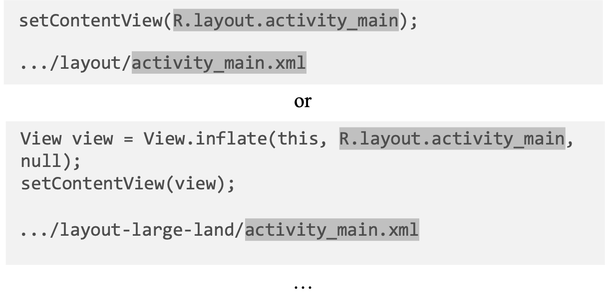
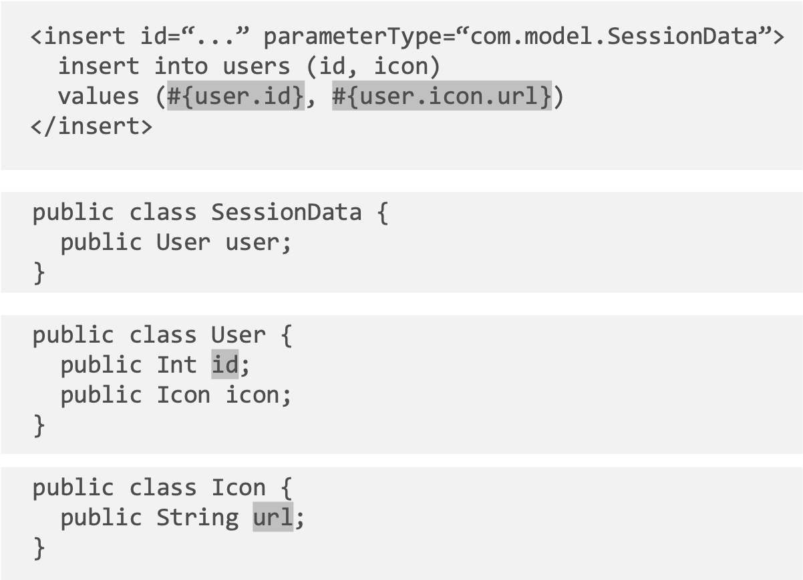
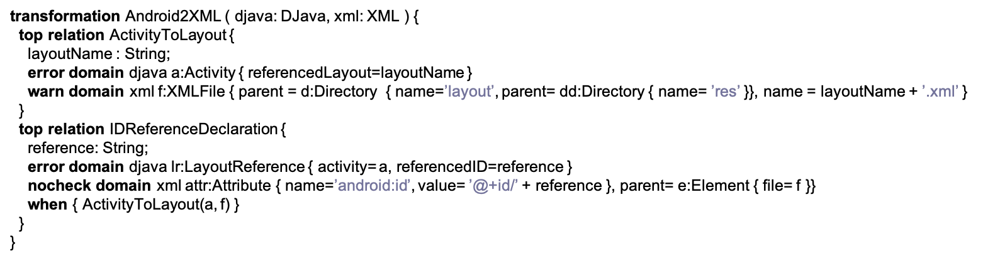
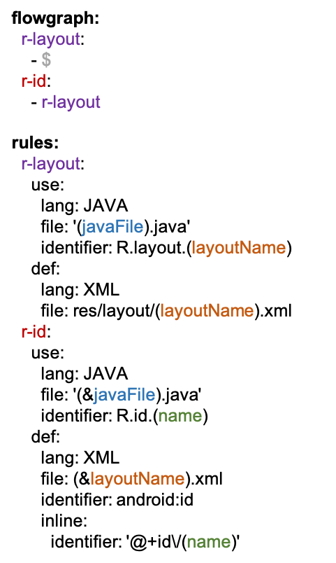

# Supplementary Material of the Evaluation of Expressiveness

## Table of content
- [Complete table of results](complete_table_of_results.pdf)
- [Taxonomy of constraints](#taxonomy-of-constraints)
- [Explanation of bad cases](#explanation-of-bad-cases)
- [Comparison to the baseline](#comparison-to-the-baseline)
    - [Examples of Focus and baseline](#examples-of-focus-and-baseline)
    - [Expressiveness](#expressiveness)
    - [Conciseness](#conciseness)
    - [Generalization](#generalization)

# Taxonomy of constraints
In the [complete table](complete_table_of_results.pdf), a detailed description is attached to make the taxonomy of constraints more clear.
Each convention may involve different constraints, which is marked in the column of the convention (except the last two rows, which contain the results of capability evaluation on this convention).
For example, in Android framework *"layout link: content view"* refers to a convention that links the layout file with the layout resource. The layout resource is usually referenced in the *Activity* setting method or the context of it, so the typical examples of the convention *"layout link: content view"* are as follows:

<div align=center></div>

In Android framework, the content of the layout file (such as widget ids declared in this layout) will be stored in the resource and the layout resource can be referenced with a prefix `R.layout.` added to its file name. So this convention involves constraints on the naming of the identifiers. As can be seen in the [complete table](complete_table_of_results.pdf), we marked two constraints in the column of the convention *layout link: content view*: 
- the *independent-naming-prefix/suffix* constraint.
- the *inter-related-naming-prefix/suffix change* constraint.
# Explanation of bad cases

## Conventions not supported
All of the 6 conventions not supported by **Focus** DSL have a same feature: any of them can be mapped to a non-enumerable set of concrete code patterns.
Let's firstly define what a *code pattern* is here: it can be seen as a simplified template determining features of certain code snippets based on text matching, for example, we can use `* + *` to describe an additive expression like `1 + 2` or `a + 3` etc., but not `1 + 2 + 3`.
And the mapping between conventions and code patterns works like this: the convention *layout link: content view* mentioned in the last section should be mapped to these code patterns: `{"SetContent(R.layout.*)", "View.inflate(this, R.layout.*), "*/layout/*.xml"}`.
So what kind of conventions is mapped to a non-enumerable set of concrete code patterns?
Some conventions usually involve execution of expressions or nested iteration of method invocations. As a result, we can't define one or multiple code patterns to conclude them. For example, this is a code snippet of convention *parameter field link* in Mybatis framework:

<div align=center></div>

In this example, `#{user.id}` refers to the member field `id` of the object `user` (which is a member field of the class `SessionData`) and `#{user.icon.url}` refers to the member field `url` of the object `icon` (which is a member field of the object `user`). The two identifiers are similar in the format, only different in the depth of member field access. However, since all possible depths of different instances of this convention theoretically compose a non-enumerable set containing infinite numbers of elements, it's impossible to define rules to express it perfectly with **Focus** DSL.
But we should point out that, although in theory **Focus** DSL can't express such conventions due to lack of enumerability, in practice some of them can be reduced to a limited set, e.g. in the above example, we can assume that the depth of member field access is less than 6 since more deep nesting is usually avoided by the developers to guarantee the readability of the code. In this case, we can define rules to cover most of the practical scenarios with **Focus** DSL.

## The convention partially supported
The only convention partially supported by Focus DSL is *id link: view binding*.
In some condition, this convention involves the position information of siblings in the context, which is not supported in Focus DSL.
For example, when there are more than one *view binding* objects with the same name in the same JAVA class, we may need position information of elements in the context to reason about the scope of the referenced binder object, determining which view the binder object is bound to. It's also the reason why constraints related to sibling elements are marked as partially supported: in a broad sense, more information about sibling elements should be captured and described in the DSL if we want to cover the above cases perfectly.

# Comparison to the baseline
## Examples of Focus and baseline
Express *id link: resource access* with QVT/R-Link:
<div align=left></div>

Express *id link: resource access* with Focus:
<div align=left></div>

## Expressiveness
Based on a powerful model transformation specification, QVT/R-Link (with meta-models manually designed respectively for involved languages) shows a good ability to specify certain patterns, but QVT/R-Link also has limits in specifying some constraints, especially context-related constraints.
Compared to QVT/R-Link, Focus DSL shows a better ability in specifying the nested layers of the ancestors and siblings of identifiers, since in Focus DSL we can directly write the template of a URI to represent necessary hierarchical information  around an identifier, while QVT/R-Link can only specify ancestors and siblings by iteratively declaring the parent of identifiers, which usually fail to meet the need for expressing flexible hierarchical information.
For example, in convention *view link: return value  (static)*, the return value which represents the relative path of the bound view is linked to the corresponding view file, e.g. return value `"admin/blog/index"` linked to the file `"src/main/templates/admin/blog/index.html"`. In **Focus**, the file path is modeled as a path in a tree where each node represents a directory or a file, and we can fold some of the nodes in the path when we describe it using **Focus** DSL. So, this is how we describe this convention in **Focus** DSL:
```yaml
r-htmlPath:
    use:
        lang: JAVA
        file: "(root...)/src/main/**/(javaFile).java"
        identifier: "(functionName)/return/**"
        inline:
        identifier: (htmlFile...)
    def:
        lang: FILE
        file: (root...)/src/main/templates/(htmlFile...).html
```
The `htmlFile` capture stores the common part of the return value and the file name (namely, `admin/blog/index`).

On the contrary, firsly it's hard to parse a string literal into a file path in QVT/R-Link, and in QVT/R-Link we can only use propeties of file objects like *parent* to track which directory this file belongs to. You need to iteratively track the parent directory in this process to get a longer part of the whole file path, which can't work in this example.

## Conciseness
In conciseness, **Focus** DSL also outperforms QVT/R-Link since **Focus** DSL is a concisely organized language designed for XLL specification while QVT/R-Link is based on an elaborate language QVT/R which is for other purpose.
**Focus** DSL adopts *YAML* as the base language, using `list` and `dictionary` to organize data, which is suitable to describe the *URI* model, while QVT/R-Link uses a object-oriented format where the context information can only be described in the form of a property in the object of the corresponding identifier.

For example, in QVT/R-Link, we need to wrap key information in multiple brackets to express the hierarchical information (it is also mentioned in the last section [Expressiveness](#expressiveness)) like `parent=o:object{name="A", parent=oo:object{name="B"…}}`, which can be easily expressed in **Focus** DSL by `.../B/A`.

## Generalization
In the ability of generalization, **Focus** DSL cost much less to be generalized to other frameworks and projects, since it applies a generic model *URI* which can be adapted to most programming languages, while in QVT/R-Link extra overhead of designing meta models for all new languages is required to be adapted to new frameworks.
In QVT/R-Link, meta models contain more directive information strongly bound to some of the conventions, but can lead to a burden of designing and extra overhead to be generalized to other frameworks and projects.
For example, in [the provided code examples](#examples-of-focus-and-baseline), we can see many of the classes are defined especially to express this XLL: 
- class `Activity` refers to the layouts referenced in the form of `R.layout.layout_name` (in this case, the value of `referencedLayout` should be `layout_name`).
- class `LayoutReference` refers to the widgets referenced in the form of `R.id.widget_id`(in this case, the value of `referenceId` should be `widget_id`, the value of `activity` should be an instance of class `Activity` which is the layout this widget belongs to).

Instances of them need to be extracted specifically in the implementation, which leads to extra burden programmatically. 
This model also makes some assumptions, e.g. the `activity` value of `LayoutReference` instances can always be extracted accurately, which are sometimes not true in our observation.
On the other hand, in **Focus**, different languages from different frameworks can be transformed into the *URI* model naturally and generically since the *URI* is essentially an enhanced tree structure, which is simpler but more flexible than the meta models in QVT/R-Link.